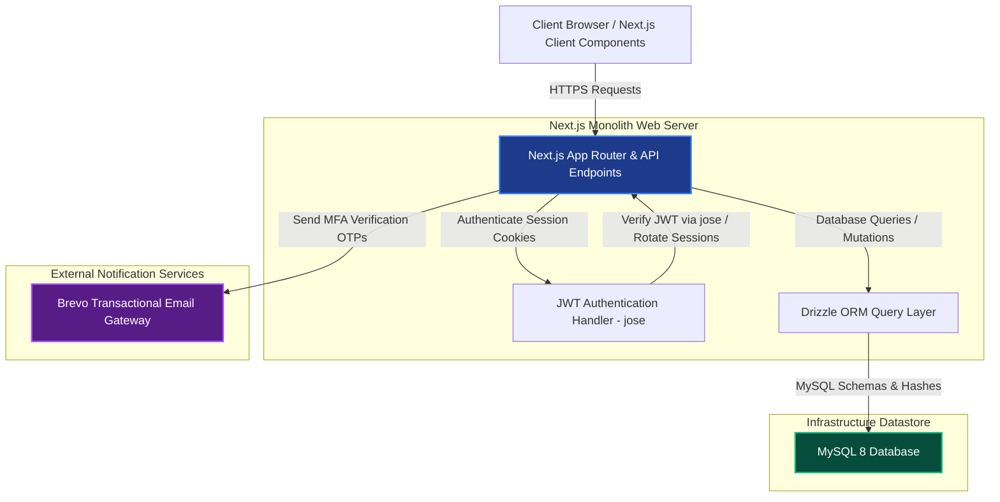
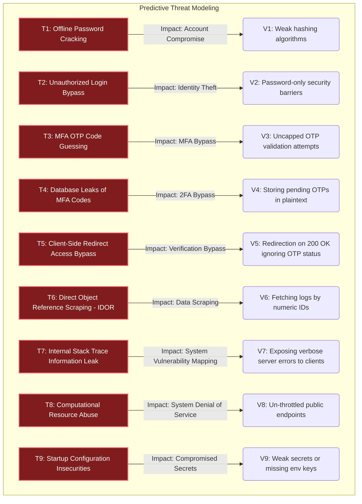

# NutriON - Information Assurance & Security Report
**System Security Architecture and Predictive Threat & Vulnerability Audit**

---

## 1. System Overview & Architecture

### 1.1. System Description
NutriON is a responsive web application built to help users track daily calories, evaluate macronutrient ratios (protein, carbohydrates, fats), and obtain AI-guided nutritional tips. Because NutriON collects personal student profiles, email addresses, and dietary logs, Information Assurance & Security (IA&S) is built directly into the monolithic architecture. The system secures access using secure password hashing, signed session tokens, and mandatory email-based Multi-Factor Authentication (MFA) on registration and every login attempt.

### 1.2. Target Users
1.  **Students & Health Trackers**: Log daily food intake, monitor macro goals, and review educational nutrition guides.
2.  **System Admins**: Create and manage nutrition lessons, review system usage reports, and audit user logs.

### 1.3. System Architecture
NutriON operates as a secure Next.js monolith using a MySQL database and third-party gateways, backed by strict cryptographic controls.



---

## 2. Threat & Vulnerability Identification
*(Predictive Analysis: Modeling System Threats and Vulnerabilities)*

During threat modeling, nine critical security vulnerabilities were identified that could compromise the confidentiality, integrity, or availability of the application. The system's technical controls were engineered specifically to mitigate these risks.



### T1: Offline Password Cracking & Database Leak Exposure
*   **The Threat**: If the database is compromised, password digests could be extracted and brute-forced offline using pre-computed dictionary tables.
*   **The Vulnerability**: Legacy hashing functions (like MD5, SHA-1, or plain bcrypt) are computationally fast, making them cheap and rapid to crack using modern hardware (GPUs).

### T2: Single-Factor Authentication Bypass
*   **The Threat**: If a user's password is stolen via phishing or credential stuffing, an attacker can gain immediate access.
*   **The Vulnerability**: Password-only validation fails to protect accounts if the credentials are leaked.

### T3: Multi-Factor OTP Guessing & Spamming
*   **The Threat**: Attackers can run scripts to guess 6-digit verification codes or spam OTP dispatches to exhaust the notification budget.
*   **The Vulnerability**: Lacking attempt caps on validation and rate limits on OTP generation.

### T4: Plaintext Database OTP Exposure (MFA Leak)
*   **The Threat**: Storing active verification codes in plaintext inside the database makes them vulnerable to direct extraction.
*   **The Vulnerability**: Plaintext storage of sensitive one-time credentials.

### T5: Client-Side Redirect Access Bypass
*   **The Threat**: If the login API returns a successful response (200 OK) but signals that OTP verification is required, a simple client-side router might immediately redirect to the dashboard.
*   **The Vulnerability**: Trusting HTTP status codes alone for routing rather than parsing payload parameters like `requireOtp`.

### T6: Insecure Direct Object References (IDOR) & Log Mining
*   **The Threat**: Attackers changing request IDs (e.g. asking for `/api/meals/10` instead of `/api/meals/12`) to read or modify other users' logs.
*   **The Vulnerability**: Fetching database records purely by sequential record IDs without validating if the current session user owns that specific ID.

### T7: Information Leakage via Server Stack Traces
*   **The Threat**: When network operations or database queries fail, raw server stack traces are dumped to the browser.
*   **The Vulnerability**: Leaking database structures, query strings, and project paths to clients, which helps attackers map the system.

### T8: API Denial of Service (DoS) and Resource Exhaustion
*   **The Threat**: Attackers spamming endpoints to exhaust database connections or server processing pools.
*   **The Vulnerability**: Operating public endpoints without global or route-specific rate limiting.

### T9: Weak Production Secrets and Insecure Configurations
*   **The Threat**: Monolithic applications relying on weak cryptographic secrets to sign session payloads.
*   **The Vulnerability**: Running in production with default secrets or invalid environment keys.

---

## 3. Security Implementation
*(Technical Audits and Implemented Controls Matrix)*

To mitigate and resolve each of the threats described above, NutriON incorporates the following security controls:

---

### Control 1: Argon2id Password Hashing
*   **Threat Addressed**: T1: Offline Password Cracking & Database Leak Exposure
*   **How it Works**: NutriON hashes passwords asynchronously using **Argon2id** (the industry-standard winner of the Password Hashing Competition) via the native `argon2` library. This algorithm enforces memory and CPU runtime constraints to resist hardware-accelerated brute-force attacks. Unique salts are generated for every password automatically.
*   **Drizzle Schema**:
```typescript
// Location: src/db/schema/users.ts
import { mysqlTable, varchar, timestamp, serial } from "drizzle-orm/mysql-core";

export const users = mysqlTable("users", {
  id: serial("id").primaryKey(),
  email: varchar("email", { length: 255 }).notNull().unique(),
  passwordHash: varchar("password_hash", { length: 255 }),
  role: varchar("role", { length: 50 }).default("user").notNull(),
  emailVerifiedAt: timestamp("email_verified_at"),
  createdAt: timestamp("created_at").defaultNow().notNull(),
  updatedAt: timestamp("updated_at").defaultNow().onUpdateNow().notNull(),
});
```

---

### Control 2: Mandatory Two-Factor Verification (OTP) on Registration and Login
*   **Threat Addressed**: T2: Single-Factor Authentication Bypass
*   **How it Works**: Registration and login both require email verification codes. Successful credentials check does not log the user in; instead, it generates a code, sends it to the user's inbox via Brevo, and redirects the client to the `/verify-otp` page. JWT tokens are only issued *after* the correct OTP is entered.

---

### Control 3: Hashed OTP Storage, Expiry, and Locked Out Thresholds
*   **Threat Addressed**: T3: Multi-Factor OTP Guessing & T4: Plaintext Database OTP Exposure
*   **How it Works**: One-Time Passwords are generated using cryptographic randomness. The database table `email_otps` stores a secure **SHA-256 hash** of the code, never the plaintext. The code expires in 10 minutes and is invalidated immediately on use. In accordance with strict attempt limits, the system rejects verification requests if the user has reached 5 failed attempts (`attemptCount >= 5`).
*   **Drizzle Schema**:
```typescript
// Location: src/db/schema/auth.ts
import { mysqlTable, varchar, timestamp, int, serial } from "drizzle-orm/mysql-core";

export const emailOtps = mysqlTable("email_otps", {
  id: serial("id").primaryKey(),
  email: varchar("email", { length: 255 }).notNull(),
  userId: int("user_id"),
  purpose: varchar("purpose", { length: 50 }).notNull(),
  codeHash: varchar("code_hash", { length: 255 }).notNull(),
  expiresAt: timestamp("expires_at").notNull(),
  consumedAt: timestamp("consumed_at"),
  attemptCount: int("attempt_count").default(0).notNull(),
  createdAt: timestamp("created_at").defaultNow().notNull(),
});
```

---

### Control 4: Client-Side Routing Verification & Payload Checks
*   **Threat Addressed**: T5: Client-Side Redirect Access Bypass
*   **How it Works**: The frontend login page explicitly checks the response payload rather than trusting the HTTP status code. If `response.data.requireOtp` is true, the user is redirected to `/verify-otp?email=...`, blocking access to the dashboard. The input fields are styled to turn red if the validation fails.
*   **Code Example**:
```typescript
// Location: src/app/(auth)/login/page.tsx
const response = await api.post("/api/auth/login", values);
if (response.data?.requireOtp) {
  toast.info("Security code sent to email.");
  router.push(`/verify-otp?email=${encodeURIComponent(values.email)}`);
} else {
  toast.success("Logged in successfully!");
  router.push("/dashboard");
}
```

---

### Control 5: HTTP-Only, Secure, and SameSite Session Cookies
*   **Threat Addressed**: T2: Single-Factor Authentication Bypass (Session Theft)
*   **How it Works**: Session tokens are signed using the `jose` library (HS256) and stored inside two cookies: `nutrion_access` (JWT Access Token) and `nutrion_refresh` (Refresh Token). Both cookies are configured with `HttpOnly` and `Secure` (in production) attributes to prevent client-side JavaScript (XSS attacks) from reading them. `SameSite=Lax` cookie parameters defend against cross-site request forgery (CSRF).

---

### Control 6: Explicit User Ownership Database Checks (Anti-IDOR)
*   **Threat Addressed**: T6: Insecure Direct Object References (IDOR)
*   **How it Works**: Every database query that fetches or modifies goals, logs, or profiles forces a server-side filter against the authenticated user ID (`session.user.id`). Direct object references passed via API calls are verified to belong to the active user before execution, ensuring users cannot view other profiles.
*   **Drizzle Example**:
```typescript
// Enforce owner check in query
const userMeals = await db
  .select()
  .from(meals)
  .where(and(eq(meals.id, mealId), eq(meals.userId, session.user.id)));
```

---

### Control 7: Boot Validation of Secrets and Environment Keys
*   **Threat Addressed**: T9: Weak Production Secrets and Insecure Configurations
*   **How it Works**: NutriON validates all environment configurations at server start using a Zod schema. If mandatory keys (like `JWT_ACCESS_SECRET`, `AUTH_SECRET`, or `BREVO_API_KEY`) are missing, invalid, or left as defaults, the server terminates immediately during boot, preventing it from running in an insecure state.
*   **Code Example**:
```typescript
// Location: src/lib/env.ts
import { z } from "zod";

const envSchema = z.object({
  DATABASE_URL: z.string().min(1),
  AUTH_SECRET: z.string().min(8),
  JWT_ACCESS_SECRET: z.string().min(16),
  BREVO_API_KEY: z.string().min(1),
});

export const env = envSchema.parse(process.env); // Crashes server on validation failure
```

---

### Control 8: Non-Disclosing Exception Handlers
*   **Threat Addressed**: T7: Information Leakage via Server Stack Traces
*   **How it Works**: API routes are wrapped in global try-catch blocks. If a MySQL database connection drops or a query errors, the system catches the exception and returns a generic response (e.g. `{ error: "Internal Server Error" }`) to the user, logging the detailed stack trace to secure server-side files instead of exposing it to the client.

---

### Control 9: Lockout Enforcement
*   **Threat Addressed**: T3: Multi-Factor OTP Guessing
*   **How it Works**: The backend database verification route check enforces a lockout condition:
```typescript
// Location: src/app/api/auth/verify-otp/route.ts
if (latestOtp.attemptCount >= 5) {
  return NextResponse.json({ error: "Max verification attempts exceeded. Please request a new code." }, { status: 400 });
}
```
If incorrect OTP codes are submitted 5 times, the code is locked out, requiring a new code request.

---

## 4. IA&S Audit Conclusion

NutriON enforces a robust security architecture. By performing predictive threat modeling, the engineering team successfully implemented controls covering secure hashing (Argon2id), mandatory multi-factor authentication (Brevo OTP), secure cookie management, explicit owner checking (anti-IDOR), and non-disclosing error wrappers. 

These integrated defenses ensure that NutriON remains resilient against standard web vulnerability threats (OWASP Top 10), protecting student email directories and nutrition history records.
